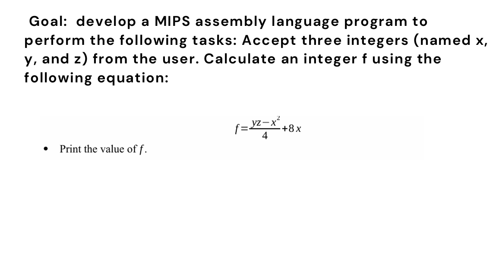
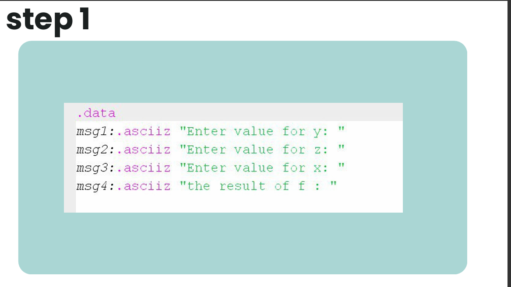
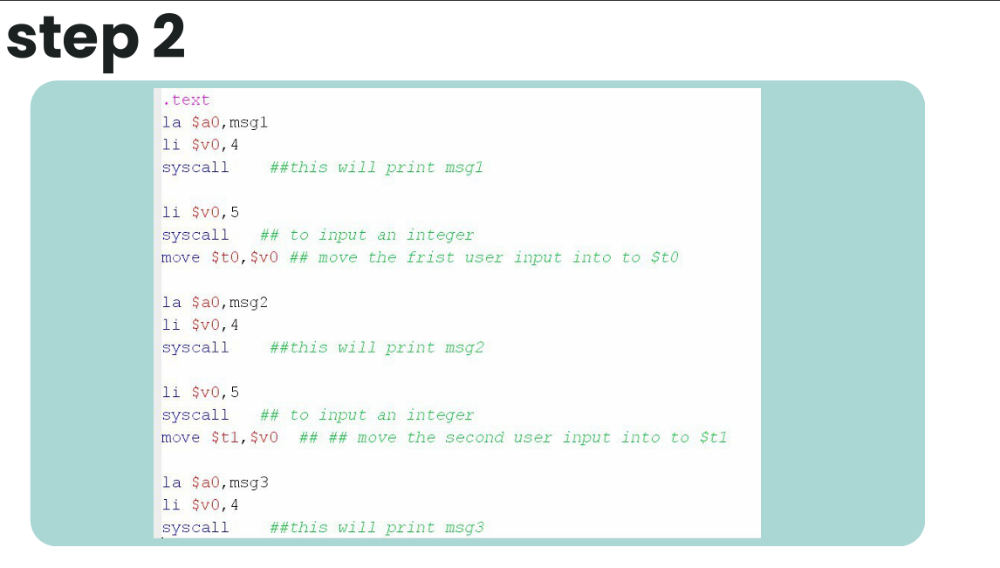
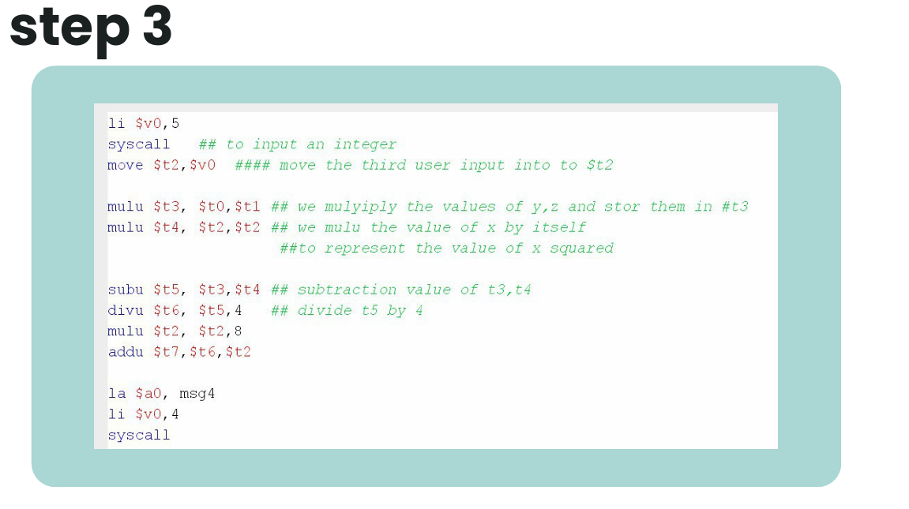
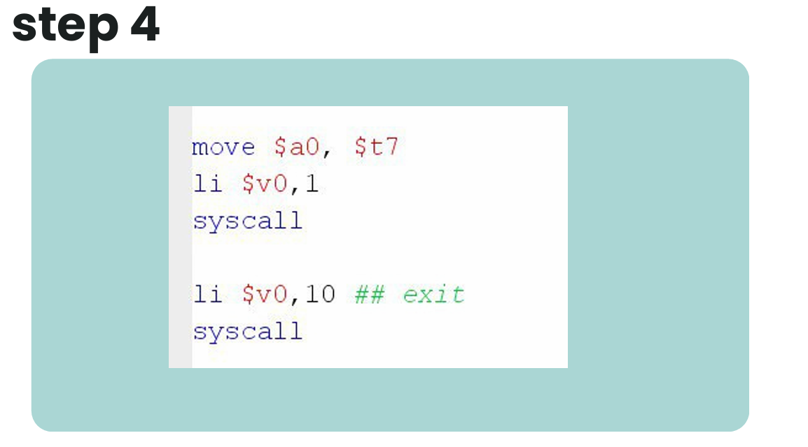
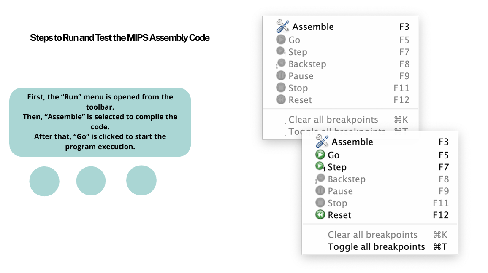
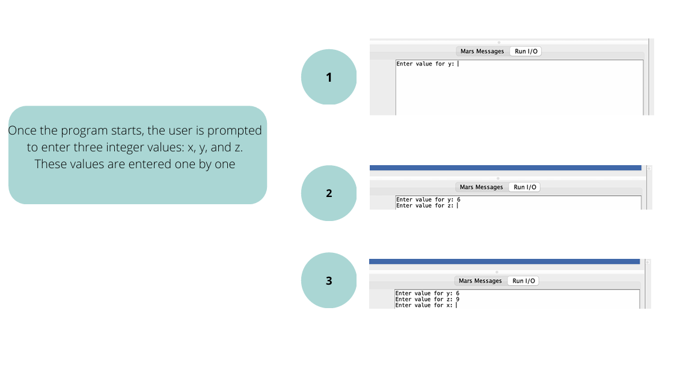
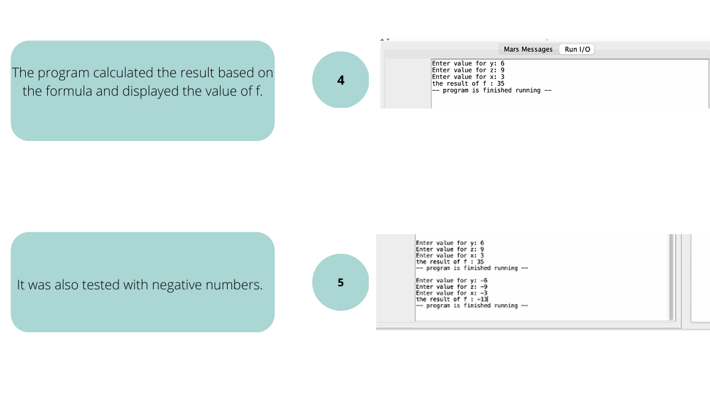

# Computer Organization and Architecture Project 💻📟

## 📌 Project Overview
The goal of this project is to develop a **MIPS Assembly Language** program that performs specific arithmetic operations. The program accepts three integers (named x, y, and z) from the user, calculates an integer **f** using a specific equation, and prints the final result.

### 🧮 The Equation
The program implements the following mathematical formula:
$f = \frac{yz - x^2}{4} + 8x$

---

## 📸 Step-by-Step Implementation

### 1️⃣ Project Objective
| GOAL: DEVELOP A MIPS ASSEMBLY LANGUAGE PROGRAM |
|---|
|  |
| **Slide 2** |

### 2️⃣ Assembly Code Breakdown (Steps 1 - 4)
| STEP 1: DATA SEGMENT & MESSAGES | STEP 2: PRINTING MESSAGES & INPUT |
|---|---|
|  |  |
| **Slide 3** | **Slide 4** |

| STEP 3: INPUT HANDLING & REGISTER MOVE | STEP 4: CALCULATING THE EQUATION |
|---|---|
|  |  |
| **Slide 5** | **Slide 6** |

### 3️⃣ Execution & Testing Environment
| STEPS TO RUN AND TEST THE MIPS ASSEMBLY CODE | ONCE THE PROGRAM STARTS (USER INPUT) |
|---|---|
|  |  |
| **Slide 7** | **Slide 8** |

### 4️⃣ Final Output & Results
| CALCULATING THE RESULT BASED ON THE FORMULA |
|---|
|  |
| **Slide 9: Performance and Negative Number Testing** |

---

## 🛠 Technical Details
* **Language:** MIPS Assembly.
* **Simulator:** MARS (MIPS Assembler and Runtime Simulator).
* **Instruction Set:** Used `li`, `la`, `syscall`, `move`, `mult`, `sub`, `div`, and `add`.
* **Registers:** Efficiently managed registers ($t0, t1, t2$) for storing variables and ($v0, a0$) for system calls.

## 👥 Team & Contributions
*Developed by: Alanoud Suad, Fatimah Saad, Waad Saud, Khawalah Khaled, and Amal Abdullah.*

---
*University Project - Computer Organization & Architecture Course*
